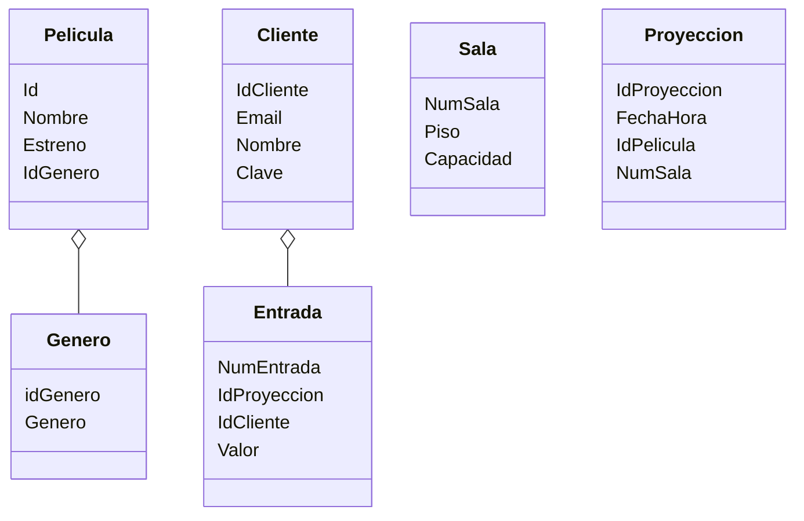

```mermaid
    classDiagram
    
        Pelicula o-- Genero
        Cliente o-- Entrada
    
        class Genero{
            idGenero
            Genero
        }
    
        class Sala{
            NumSala
            Piso
            Capacidad
        }
    
        class Pelicula{
            Id
            Nombre
            Estreno
            IdGenero
        }
    
        class Cliente{
            IdCliente
            Email
            Nombre
            Clave
        }
    
        class Proyeccion{
            IdProyeccion
            FechaHora
            IdPelicula
            NumSala
        }
    
        class Entrada{
            NumEntrada
            IdProyeccion
            IdCliente
            Valor
        }
```