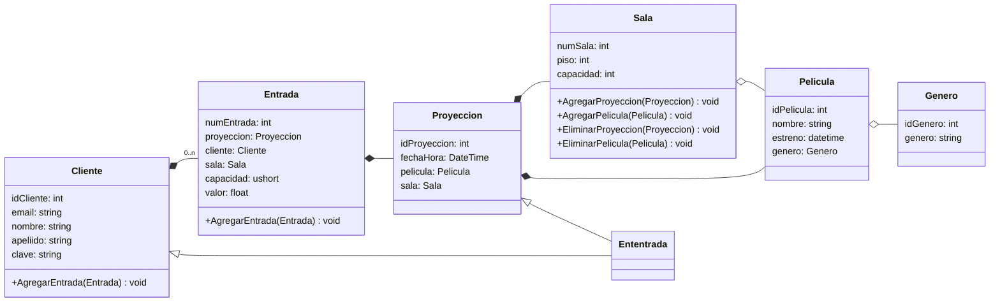

```mermaid
    classDiagram
    direction LR
        Pelicula o-- Genero
        Cliente *-- "0..n" Entrada
        Sala o-- Pelicula
        Proyeccion *-- Sala
        Proyeccion *-- Pelicula
        Entrada *-- Proyeccion
        Cliente <|--  Ententrada
        Proyeccion  <|-- Ententrada


        class Genero{
            idGenero: int
            genero: string
        }
    
        class Sala{
            numSala: int
            piso: int
            capacidad: int
            +AgregarProyeccion(Proyeccion) void
            +AgregarPelicula(Pelicula) void
            +EliminarProyeccion(Proyeccion) void
            +EliminarPelicula(Pelicula) void
        }

        class Entrada {
            +AgregarEntrada(Entrada) void
        }
    
        class Pelicula{
            idPelicula: int
            nombre: string
            estreno: datetime
            genero: Genero
        }
    
        class Cliente{
            idCliente: int
            email: string
            nombre: string
            apeliido: string
            clave: string
            +AgregarEntrada(Entrada) void
        }
    
        class Proyeccion{
            idProyeccion: int
            fechaHora: DateTime
            pelicula: Pelicula
            sala: Sala            
        }
    
        class Entrada{
            numEntrada: int
            proyeccion: Proyeccion
            cliente: Cliente
            sala: Sala
            capacidad: ushort
            valor: float
        }
```